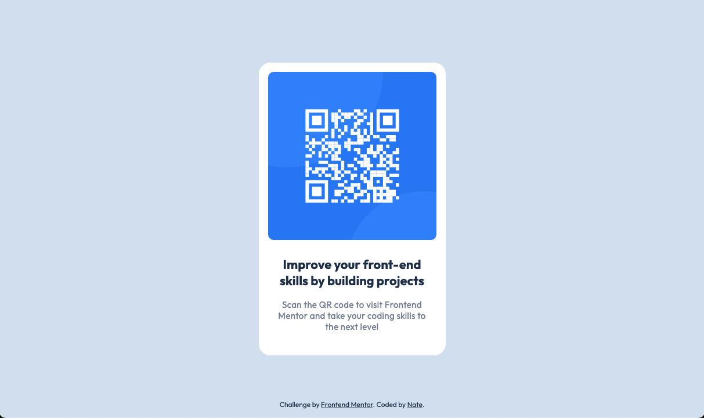

# Frontend Mentor - QR code component solution

This is a solution to the [QR code component challenge on Frontend Mentor](https://www.frontendmentor.io/challenges/qr-code-component-iux_sIO_H). Frontend Mentor challenges help you improve your coding skills by building realistic projects. 

## Table of contents

- [Overview](#overview)
  - [Screenshot](#screenshot)
  - [Links](#links)
- [My process](#my-process)
  - [Built with](#built-with)
  - [What I learned](#what-i-learned)
  - [Continued development](#continued-development)
- [Author](#author)

## Overview

### Screenshot

### Links

- Solution URL: [frontendmentor.io/solutions/qr-code-component-8jrjBOt3R7](https://www.frontendmentor.io/solutions/qr-code-component-8jrjBOt3R7)
- Live Site URL: [ntjnh-qr-code.netlify.app](https://ntjnh-qr-code.netlify.app/)

## My process

### Built with

- [React](https://reactjs.org/)
- Custom CSS
- Flexbox
- Mobile-first

### What I learnt

Wouldn't say I learnt anything new but it was a really good way to practice the little bit of React that I've learnt so far.

### Continued development

I definitely want to keep doing more challenges with React and eventually be able to build more complex things with it to really solidify my knowledge and strengthen my new skill.

## Author

- Website - [Nate](https://natejonah.com)
- Frontend Mentor - [@ntjnh](https://www.frontendmentor.io/profile/ntjnh)
- Twitter - [@natejonah](https://www.twitter.com/natejonah)
